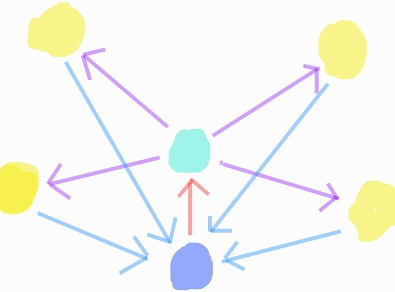

## Clusters

**Clusters is the first natively crosschain name service.**

Clusters is:

-   **Crosschain**: Register a name on any of 10+ chains, then global state is relayed to Ethereum and the rest.
-   **Wallet Bundles**: Join all your wallet addresses under a single name. EVM, Solana, Bitcoin, etc.
-   **No More Squatting**: Our bid-based dynamic pricing means squatters pay a heavy price for stealing names.

## Website

https://clusters.xyz

## Technical Architecture

### Crosschain

We apply a hub-and-relay-and-spoke model built on LayerZero. Suppose that the protocol lives on 5 EVM chains - Ethereum, Polygon, Arbitrum, Optimism, and BSC. A user can initiate a cluster creation (or other action) from BSC. The intent data is relayed from BSC to Ethereum, where the tx is ordered and finalized. Then Ethereum sends along the finalized state diff to the relay network (say Polygon) which will further send to the rest of the spokes: Arbitrum and Optimism. This allows clean O(1) tx cost on expensive Ethereum while scaling to a dozen+ spokes in due time. 

### Wallet Bundles

Each cluster is uniquely denoted by its `uint256 clusterId`, an incrementing integer. A cluster contains one or more `bytes32 address`, which can be an EVM address or other address formats. A user creates a cluster and can add other addresses in the same multicall transaction. These addresses are `unverified` cluster members until they accept the invitation and become `verified` cluster members.

Then a wide variety of apps (gaming leaderboards, points systems, connect wallet modals) can read this onchain cluster membership data and aggregate user profiles onchain and offchain.

### No More Squatting

The failure case of many nameservices is becoming overrun by squatters. Excessive speculation can actually reduce net economic welfare. Inspired by [vitalik's blog post](https://vitalik.ca/general/2022/09/09/ens.html), we introduce demand-based capped pricing. Names have a flat annual fee (say 0.01 eth) that increases up to a cap if and only if others make verifiable onchain bids on that name. This means the median user with a specific name will pay the minimum, and squatters will pay higher recurring fees making squatting economically infeasible.
